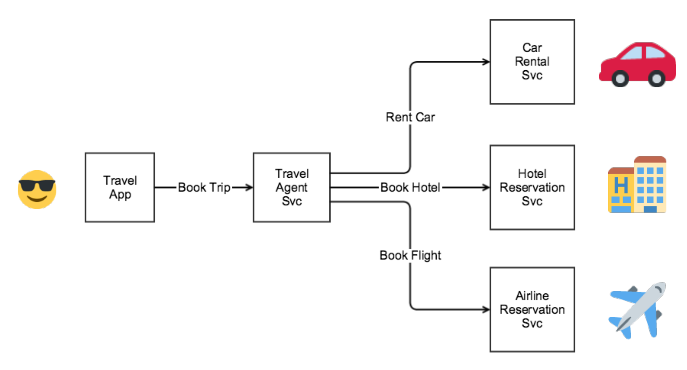

# Sagaサンプル（旅行予約アプリケーション）

Travel Agent ServiceはBook Tripを受け付ける。Rent Car, Book Hotel, Book Flightを順に実行する。全てが完了したらBook Tripは完了になる。

## Rent Car, Book Hotel, Book Flightを順に実行

メッセージングで実行を依頼する。各サービスからはメッセージングで結果が返ってくる。

Rent Car Service

- 補償可能トランザクション
- 車の予約リクエストを受けて成功・失敗を返す
- 車の予約キャンセルリクエストを受けて成功を返す

Hotel Reservation Service

- ピボットトランザクション
- ホテルの予約リクエストを受けて成功・失敗を返す

Airline Reservation Service

- 再試行可能トランザクション
- 飛行機の予約リクエストを受けて成功を返す

# Sagaサンプルを動かす
## SNS/SQSのリソース作成
```shell
cd ./terraform
terraform init
terraform validate
terraform apply
```

## アプリケーション
以下の順にアプリを動かす。

```shell
./gradlew run --args="TravelAgentSvc"
./gradlew run --args="CarRentSvc"
./gradlew run --args="HotelReservationSvc"
./gradlew run --args="AirlineReservationSvc"
./gradlew run --args="bookTrip user01"
```

# Sagaサンプルを止める
## アプリケーション
アプリを停止する。

## SNS/SQSのリソース削除
```shell
cd ./terraform
terraform destroy
```

# TODO
以下は未実装。
- 予約中にキャンセルリクエストを送る。（Sagaが弱い並行処理）
- ランダムで予約に失敗する。保証トランザクションの動作テスト。
- ちょっと適当に作りすぎたのでリファクタしたい。パッケージを切ろう。後で見ても分からんようになりそう。